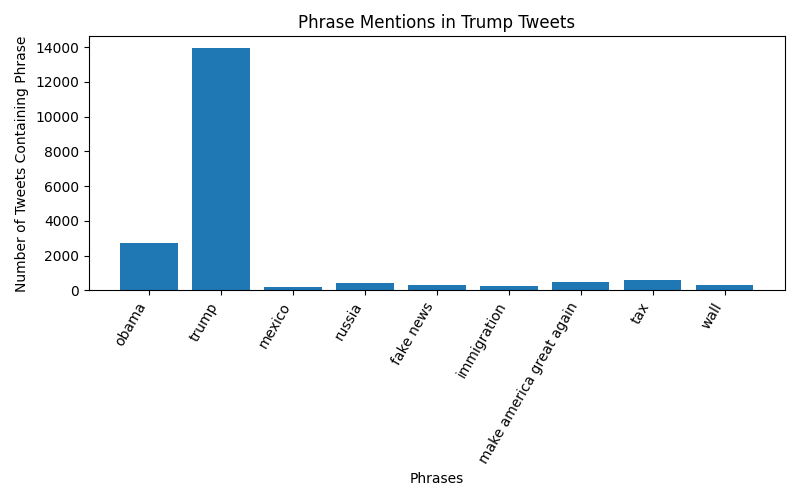

# Trump Tweet Phrase Analysis

## Phrase Frequency Table

| Phrase | Percent of tweets |
|-------:|-------------------|
|                     Obama | 07.47% |
|                     Trump | 38.35% |
|                    Mexico | 00.55% |
|                    Russia | 01.13% |
|                 Fake News | 00.92% |
|               Immigration | 00.64% |
|  Make America Great Again | 01.27% |
|                       Tax | 01.69% |
|                      Wall | 00.91% |

Bar Plot

This graph shows that "Trump" is by far the most tweeted phrase from 2009 to 2018.
